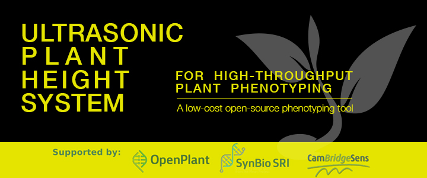
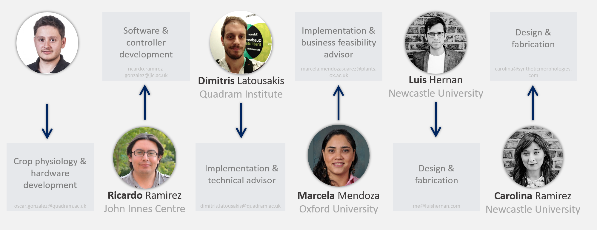

# Ultrasonic Plant Height System (UPHS)

## Synopsis
Plant height is a key trait studied in breeding and research programs. Measurements in the field are time-consuming as they require manual measurements with several replicates.  The UPHS is a phenotyping device that provides a significant improvement in sampling time and sample size. It uses low-cost ultrasonic sensors to screen the field canopy and obtain an accurate biological sample of this trait.

## Software
TBA

## Hardware
The UHPS will use an Arduino microcontroller and ultrasonic sensors to acquire plant height data. The ultrasonic sensor will emit a sound wave that will bounce back from the canopy. An initial read or manual input can be used as baseline (sensor height from the ground). This will be possible using a screen and at least three buttons. Once height zero is stored, we can calculate height from each data point and average a value from hundreds of data points collected in just a few seconds.

## Installation, Maintenance and Testing Guide
TBA

## License
MIT License

Copyright (c) 2017 Oscar E. Gonzalez-Navarro, Ricardo H. Ramirez-Gonzalez, Marcela Mendoza-Suarez, Carolina Ramirez, Luis Hernan, & Dimitris Latousakis

Permission is hereby granted, free of charge, to any person obtaining a copy of this software and associated documentation files (the "Software"), to deal in the Software without restriction, including without limitation the rights to use, copy, modify, merge, publish, distribute, sublicense, and/or sell copies of the Software, and to permit persons to whom the Software is furnished to do so, subject to the following conditions:

The above copyright notice and this permission notice shall be included in all copies or substantial portions of the Software.

THE SOFTWARE IS PROVIDED "AS IS", WITHOUT WARRANTY OF ANY KIND, EXPRESS OR IMPLIED, INCLUDING BUT NOT LIMITED TO THE WARRANTIES OF MERCHANTABILITY, FITNESS FOR A PARTICULAR PURPOSE AND NONINFRINGEMENT. IN NO EVENT SHALL THE AUTHORS OR COPYRIGHT HOLDERS BE LIABLE FOR ANY CLAIM, DAMAGES OR OTHER LIABILITY, WHETHER IN AN ACTION OF CONTRACT, TORT OR OTHERWISE, ARISING FROM, OUT OF OR IN CONNECTION WITH THE SOFTWARE OR THE USE OR OTHER DEALINGS IN THE SOFTWARE.

