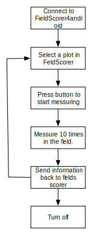
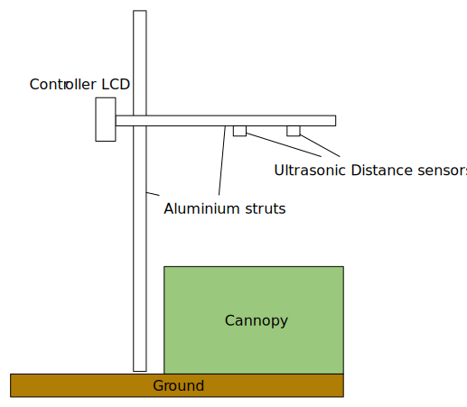
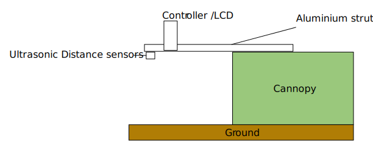
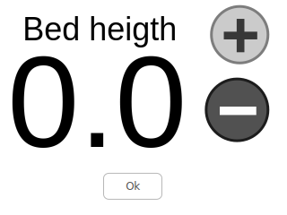
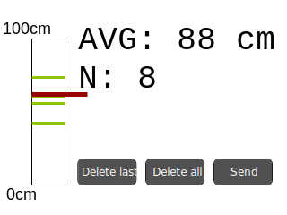

# User Interface

  * No need to callibrate
  * Enclosed case for the screen with the 
  * Buzzer tells user when the messures are take (the bar is horizontal)
  * Connects to FieldScorer4android 
  * Option for raised bed
 
The following diagram is the 'ideal' workflow in the field. 

1. Turn on and show biomaker logo (for a second)
2. Ask for bed height (up dpwn arrows) 
3. Start messuring. Only messure when the bar is horizontal for N seconds (maybe 2)
4. Press send to upload via bluetooth to FieldScorer4android

# Hardware

The struts we ordered were quite heavy and probably not usable in the field. Hence, we propose the use of a lighter version of the struts. 

Our original idea was a pair of sensors on a bar, kept stable by a vertical strut as in the following diagram. However, the aluminium struts are quite heavy, so the user will get tired quite quickly with the proposed design. 

However, we figured out that we can simplify the design by messuring the height of the sensor directly to the ground, instead of on the top of the cannopy. This will require the adition of a giroscope/angle sensor to make sure that the height is only messured when the strut is completly horizontally. This design will have a height sensor 

To make the system as user friendly, we want to use the touch screen. We currently have a gen4-uLCD-32DT. This screen has a resolution of 240x320 with resistive touch panel 

We need to design a 3D printed cage to encluse the sensor. 

Sensors used
ULTRASONIC DISTANCE SENSOR -  HC-SR04
http://cpc.farnell.com/multicomp/hc-sr04/ultrasonic-distance-sensor/dp/SN36696
Sensing Range Min: 20mm Sensing Range Max: 4m Beam Angle: 15°

# Software

The software has to be divided in three different subcompnents:

## TFT screen

Specifications of the screen: 
http://www.4dsystems.com.au/product/gen4_uLCD_32D/

The screen has a serial output, that is going to be used to controll the ruler. 

We need to display a screen to setup the height of the initial messurments

Then, for each messurment a display with the current messure and the average of them is shown. The bars on the left represent different heights, and the ticker is the bar.

 

## Arduino controller

This has to keep track of the following:
 * Read the feedback from the display (serial port)
 * Send to the display a height
 * Messure the height with the sensors
 * On each loop, decide if it is horizontal or not. 
 * Send the messurment to the bluetooth serial port 

## Communication with FieldScorer4android 

We need to add documentation on how to setup the custom field in the app
